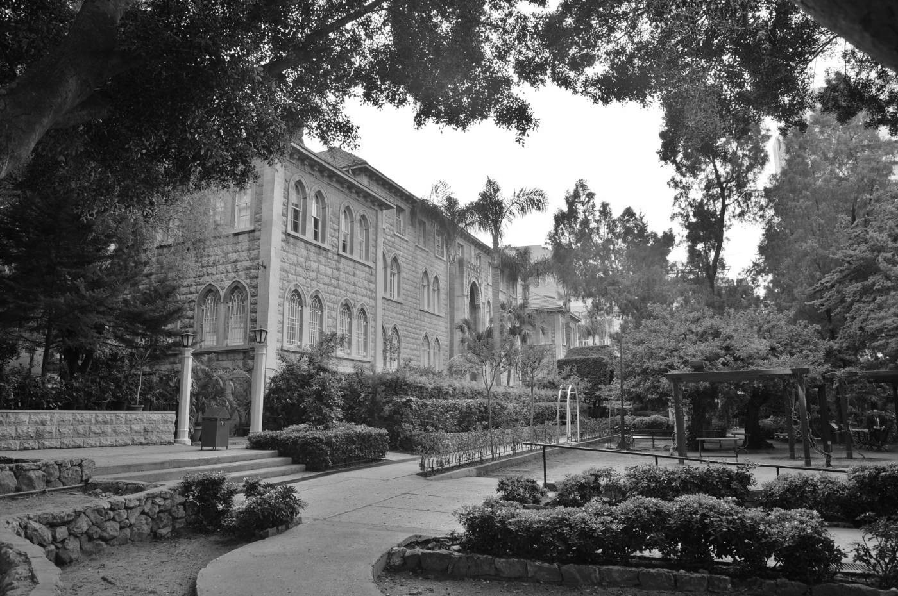
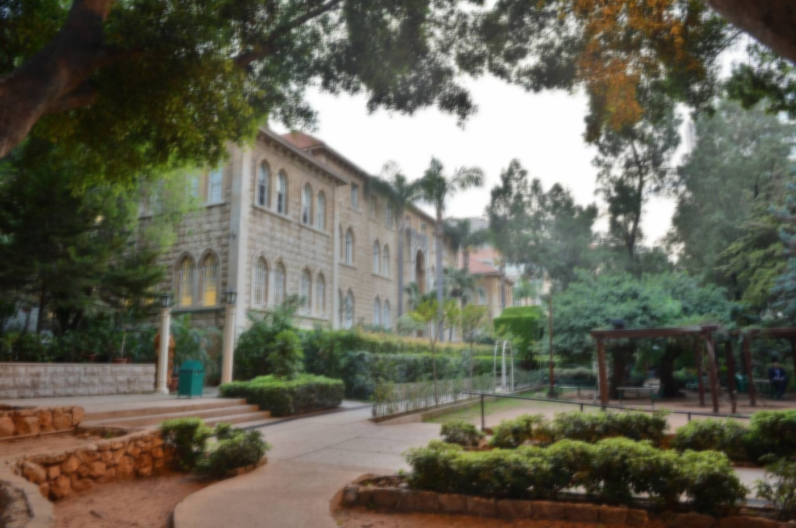

# Parallel Image Processing

## Overview
This project is part of a university course on parallel programming. It focuses on implementing image processing algorithms using parallel computing techniques. The project utilizes MPI to harness multiple processes for efficient computation.

## Tasks
### Task 1: Grayscale Conversion
- File: task1.c
- Objective: Converts an RGB image to grayscale by averaging the RGB components of each pixel. This task has been parallelized to utilize multiple processes effectively, minimizing the overhead and unnecessary data transmission.
- Execution:
```
mpicc -o task1 task1.c image.c
mpirun -np 4 task1 input_image.ppm
```

- Input Example:


- Output Example:


### Task 2: Image Blurring
- File: task2.c
- Objective: Applies a blurring effect to an image by averaging the RGB values of each pixel with those of its neighbors within a specified radius. The solution is designed to work efficiently in a parallel computing environment, distributing the workload across several processes.
- Execution:
```
mpicc -o task2 task2.c image.c
mpirun -np 4 task2 input_image.ppm 8
```

- Input Example:


- Output Example:



## Additional Notes
- Ensure that your MPI environment is correctly set up to run the solutions.
- The image files should be in PPM format. You may convert JPEG or other formats to PPM using online tools for testing purposes.

You can use this [website](https://convertio.co/jpg-ppm/) to convert your JPEG images to PPM for testing purposes.

